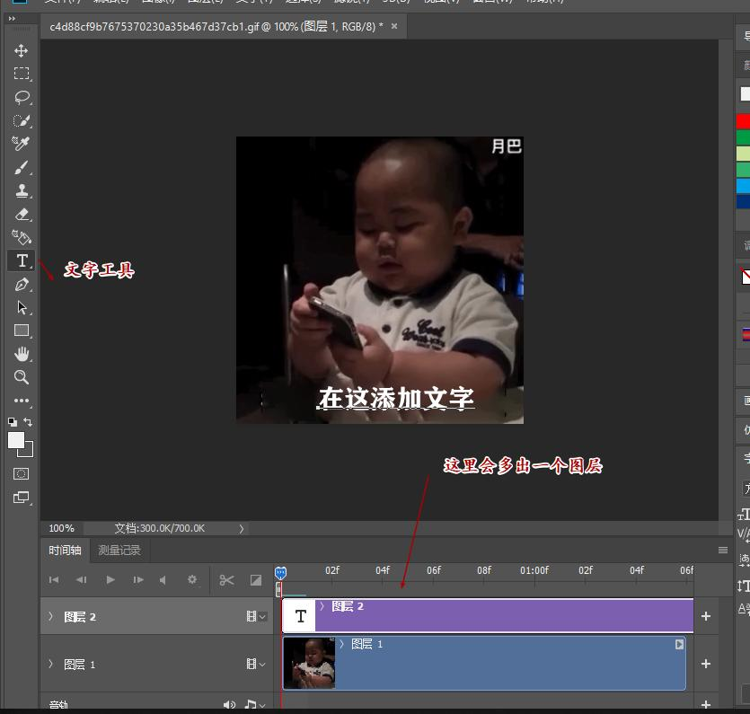
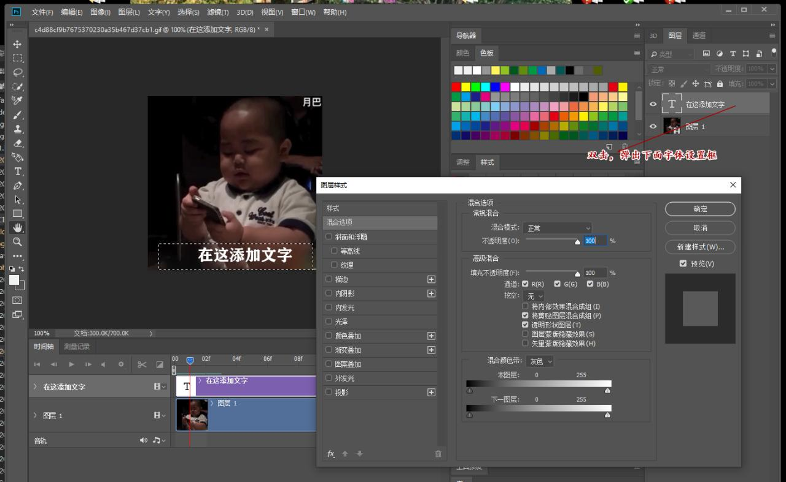
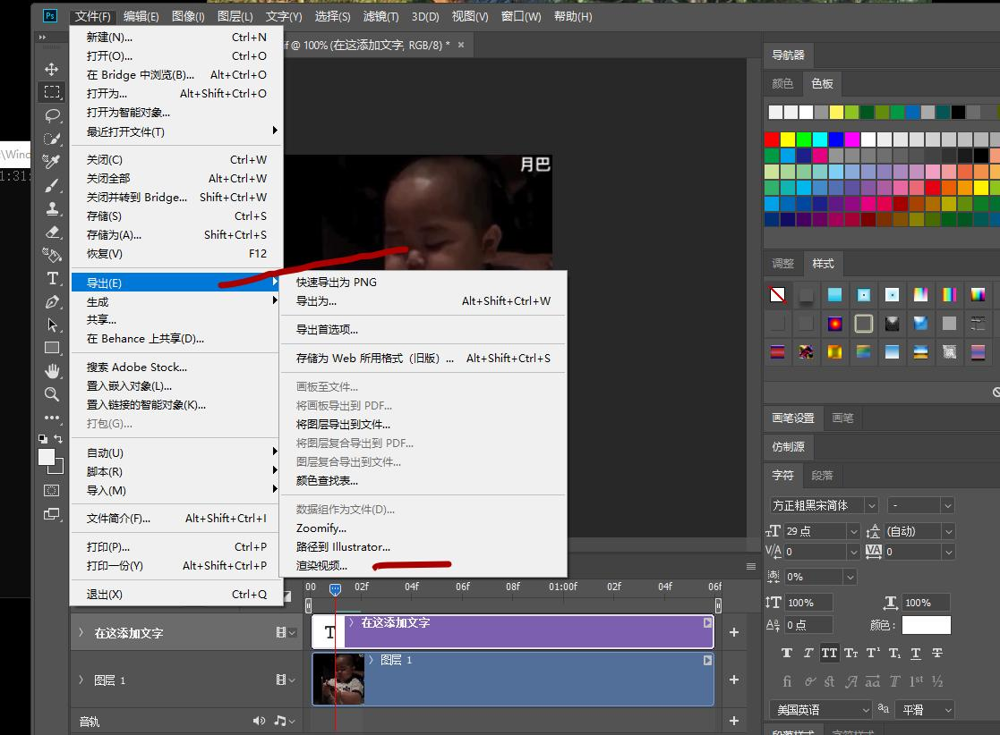

# photoshop
1. 多种工具共用一个快捷键的可同时按【Shift】加此快捷键选取; 查看所有快捷键 : 【Ctrl】+【Alt】+【Shift】+【K】 

1. 搜先介绍几个快捷键
> ctrl + h  置入 ，ctrl + d 撤销  ctrl + z 多步撤销 

### 动图（git/mp4）换字
> 第一步: 需要一张动图:      

> 第二步: 点击选取工具，然后按 shift+f5 ,点击确定（去掉原字体）。

> 第三步: 在你想添加文字的位置写上你想写的文字

> 第四步： 

> 第五步: 在每一帧上，去掉原本存在的文字。重复：选中，shift + f5  ,确定 三步 来去掉每帧上的文字。

> 第六步: 设置字体样式

> 第七步: 保存。点击渲染就可以了。

### 图片换背景
