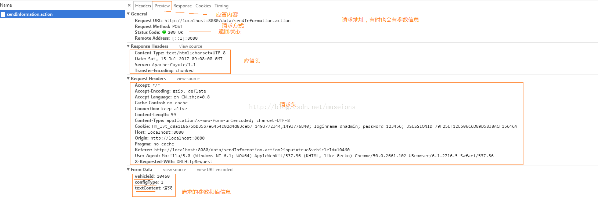
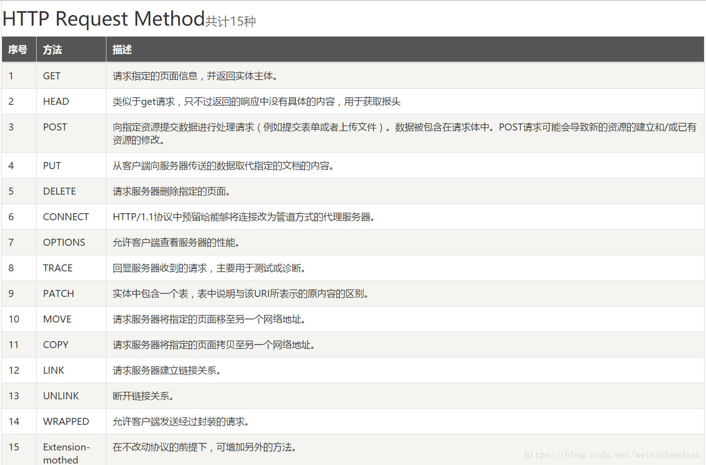

# 谷歌Network


 

```
General部分: 

Request URL:资源的请求url

Request Method:HTTP方法

Status Code:响应状态码

200（状态码） OK（原因短语）

301 - 资源（网页等）被永久转移到其它URL

404 - 请求的资源（网页等）不存在

500 - 内部服务器错误

Response Headers:

Content-Encoding:gzip ——压缩编码类型

Content-Type:text/html ——服务端发送的类型及采用的编码方式

Date:Tue, 14 Feb 2017 03:38:28 GMT ——客户端请求服务端的时间

Last-Modified:Fri, 10 Feb 2017 09:46:23 GMT ——服务端对该资源最后修改的时间，GMT是格林尼治标准时间

Server:nginx/1.2.4 ——服务端的Web服务端名

Transfer-Encoding:chunked ——分块传递数据到客户端

Request Headers:

Accept:text/html ——客户端能接收的资源类型

Accept-Encoding:gzip, deflate ——客户端能接收的压缩数据的类型

Accept-Language:en-US,en;q=0.8 ——客户端接收的语言类型

Cache-Control:no-cache ——服务端禁止客户端缓存页面数据

Connection:keep-alive ——维护客户端和服务端的连接关系

Cookie: ——客户端暂存服务端的信息

Host:www.jnshu.com ——连接的目标主机和端口号

Pragma:no-cache ——服务端禁止客户端缓存页面数据

Referer:http://www.jnshu.com/daily/15052 ——来于哪里

User-Agent: ——客户端版本号的名字
```

Request Method请求方式
