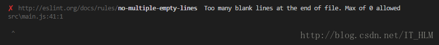
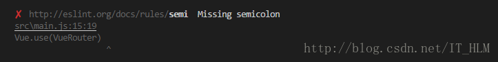
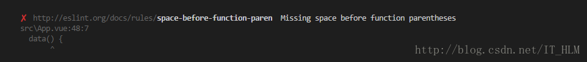
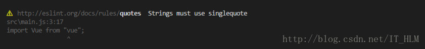
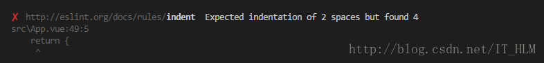
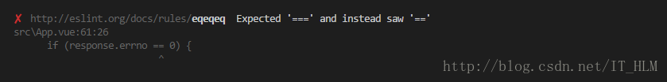
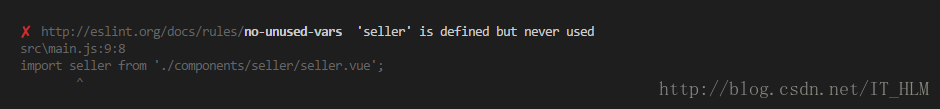
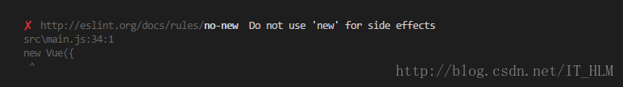
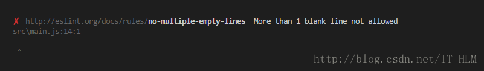
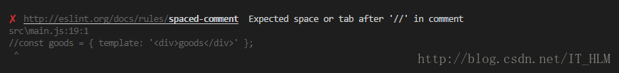

# ESlint配置
**默认eslint规则**
* 代码末尾不能加分号 ;
* 代码中不能存在多行空行 ;
* tab键不能使用，必须换成两个空格;
* 代码中不能存在声明了但未使用的变量 ;

看起来蛮不喜欢这个`1ESlint代码规范`。

`最简单的方法，关闭eslint检测得意，其实很简单，把 build/webpack.base.conf.js 配置文件中的eslint rules注释掉即可。但不推荐你这么做，eslint检测是有必要的.能保持良好的代码风格。`

```js
module.exports = {
    //此项是用来告诉eslint找当前配置文件不能往父级查找
    root: true, 
    //此项是用来指定eslint解析器的，解析器必须符合规则，babel-eslint解析器是对babel解析器的包装使其与ESLint解析
    parser: 'babel-eslint',
    //此项是用来指定javaScript语言类型和风格，sourceType用来指定js导入的方式，默认是script，此处设置为module，指某块导入方式
    parserOptions: {
        sourceType: 'module'
    },
    //此项指定环境的全局变量，下面的配置指定为浏览器环境
    env: {
        browser: true,
    },
    // https://github.com/feross/standard/blob/master/RULES.md#javascript-standard-style
    // 此项是用来配置标准的js风格，就是说写代码的时候要规范的写，如果你使用vs-code我觉得应该可以避免出错
    extends: 'standard',
    // required to lint *.vue files
    // 此项是用来提供插件的，插件名称省略了eslint-plugin-，下面这个配置是用来规范html的
    plugins: [
        'html'
    ],
    // add your custom rules here
    // 下面这些rules是用来设置从插件来的规范代码的规则，使用必须去掉前缀eslint-plugin-
    // 主要有如下的设置规则，可以设置字符串也可以设置数字，两者效果一致
    // "off" -> 0 关闭规则
    // "warn" -> 1 开启警告规则
    //"error" -> 2 开启错误规则
    // 了解了上面这些，下面这些代码相信也看的明白了
  rules: {
    // allow async-await
    'generator-star-spacing': 'off',
    // allow debugger during development
    'no-debugger': process.env.NODE_ENV === 'production' ? 'error' : 'off',
    // js语句结尾必须使用分号
    'semi': ['off', 'always'],
    // 三等号
    'eqeqeq': 0,
    // 强制在注释中 // 或 /* 使用一致的空格
    'spaced-comment': 0,
    // 关键字后面使用一致的空格
    'keyword-spacing': 0,
    // 强制在 function的左括号之前使用一致的空格
    'space-before-function-paren': 0,
    // 引号类型
    "quotes": [0, "single"],
    // 禁止出现未使用过的变量
    // 'no-unused-vars': 0,
    // 要求或禁止末尾逗号
    'comma-dangle': 0
  }
}

```
其中的rules就是配置规则的。

**配置参数**
rules: {
    "规则名": [规则值, 规则配置]
}

规则值：
`"off"或者0    //关闭规则关闭 `
`"warn"或者1    //在打开的规则作为警告（不影响退出代码）`
`"error"或者2    //把规则作为一个错误（退出代码触发时为1）`

**如何在老项目中加入ESlint**
1. 在目录中添加.editorconfig、.eslintrc.js、.eslintignore这三个文件
2. 在package.json的”devDependencies”中加入ESlint所需要的包
```
"babel-eslint": "^7.1.1",
    "eslint": "^3.19.0",
    "eslint-config-standard": "^10.2.1",
    "eslint-friendly-formatter": "^3.0.0",
    "eslint-loader": "^1.7.1",
    "eslint-plugin-html": "^3.0.0",
    "eslint-plugin-import": "^2.7.0",
    "eslint-plugin-node": "^5.2.0",
    "eslint-plugin-promise": "^3.4.0",
    "eslint-plugin-standard": "^3.0.1",
```
3. 在bulid/webpack.base.conf.js文件中加入ESlint规则并生效
```
//  在module的rules中加入
  module: {
    rules: [
      {
        test: /\.(js|vue)$/,
        loader: 'eslint-loader',
        enforce: 'pre',
        include: [resolve('src'), resolve('test')],
        options: {
          formatter: require('eslint-friendly-formatter'),
          // 不符合Eslint规则时只警告(默认运行出错)
          // emitWarning: !config.dev.showEslintErrorsInOverlay
        }
      },
    ]
  }
```
**常见的报错**
* 文件末尾存在空行(eol-last)


* 缺少分号(‘semi’: [‘error’,’always’])


* 关键字后面缺少空格


* 字符串没有使用单引号(’quotes’: [1, ’single’])


* 缩进错误


* 没有使用全等(eqeqeq)


* 导入组件却没有使用


* new了一个对象却没有赋值给某个常量(可以在该实例前添加此代码/eslint-disable no-new/忽略ESLint的检查)


* 超过一行空白行(no-multiple-empty-lines)


* 注释符 // 后面缩进错误(lines-around-comment)
