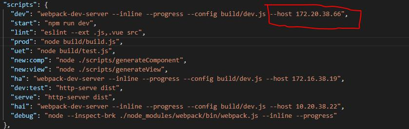

## 混合
### 动态class
给v-bind:class 设置一个对象，可以动态地切换class，如下
```html
<div id="app">
    <div :class="{'active':isActive}"></div>
</div>
<script>
var app = new Vue({
    el:'#app',
    data:{
        isActive:true
    }
})
</script>
```
最终渲染结果为：<div class="active"></div>
类名active依赖于数据isActive,当其为true时候，div会拥有类名active,为false时则没

对象中也可以传入多个属性，来动态切换class,另外，:class可以与普通class共存
```html
<div id="app">
    <div :class="{'active':isActive,'error':isError}"></div>
</div>
<script>
var app = new Vue({
    el:'#app',
    data:{
        isActive:true,
        isError:false
    }
})
</script>
```
最终渲染结果为：<div class="active"></div>
当isError为true时，对应的类名更新，如
```html
<div class="active error"></div
数组方法
<div id="app">
    <div :class="[atvieCls,errorCls]"></div>
</div>
<script>
var app = new Vue({
    el:'#app',
    data:{
        atvieCls:'active',
        errorCls:'error'
    }
})
</script>
```
最终渲染结果为：<div class="active error"></div>
也可以使用三元表达式来根据条件切换class,如：
```html
<div id="app">
   <div :class="[isActive ? activeCls : '',errorCls]"></div>
</div>
<script>
var app = new Vue({
   el:'#app',
   data:{
       isActive:true,
       atvieCls:'active',
       errorCls:'error'
   }
})
</script>
```
样式error会始终应用，当数据isActive为真时，样式active才会被应用。class有多个条件时候，这样写较为反锁，可以在数组语法中使用对象语法
```html
<div id="app">
    <div :class="[{'active':isActive},errorCls]"></div>
</div>
<script>
var app = new Vue({
    el:'#app',
    data:{
        isActive:true,
        errorCls:'error'
    }
})
</script>
```
当class的表达式过长或者逻辑复杂时候，还可以绑定一个计算属性，这是一种友好和常见的用法，一般当条件多于两个时，都可以使用data或者computed,例如
```html
<div id="app">
    <div :class="classes"></div>
</div>

<script>
var app = new Vue({
    el:'#app',
    data:{
        isActive:true,
        isError:null
    },
    computed:{
        classes(){
            return {
                active:this.isActive && !this.error,
                'text-fail':this.error && this.error.type ==='fail'
            }
        }
    }
})
</script>
```
### 多行省略
```sh
overflow: hidden;
text-overflow: ellipsis;
display: -webkit-box;
-webkit-line-clamp: 2;    // 显示的行数
-webkit-box-orient: vertical;
```
**button在移动端点击去白色背景颜色** 
`-webkit-text-size-adjust: 100%;`
`-webkit-tap-highlight-color: rgba(0, 0, 0, 0);`

### 固定ip启动
添加红框处


### 过滤器
**全局过滤器**
第一个是过滤器的名，后面借一个函数。全局和局部过滤器同名的情况下，会优先使用局部过滤器。
```sh
 Vue.filter('capitalize', function (value) {
  if (!value) return ''
  value = value.toString()
  return value.charAt(0).toUpperCase() + value.slice(1)
})
```
1. 在html中使用
```html
<p><label>分数：</label><span>{{articleLevel.score | capitalize}}</span></p>
```
2. Methods中访问Filter
```html
 <div id="body">
       <button @click='getGlobal()'>调用全局过滤器</button>
    </div>
    <script >
      new Vue({
            el:'#body',
          
            methods:{
                getGlobal(){
                    //使用Vue.Filter()方式获取全局过滤器
                    var te = Vue.filter('capitalize');
                    //调用全局过滤器
                    te('filter');
                }
            }
        })
 <script >
```
**局部过滤器**
```sh
filters: {
  capitalize: function (value) {
    if (!value) return ''
    value = value.toString()
    return value.charAt(0).toUpperCase() + value.slice(1)
  }
}
```
1. 在html中使用
```html
<p><label>分数：</label><span>{{articleLevel.score | capitalize}}</span></p>
```
2. Methods中访问Filter
```html
<div id="body">
       <button @click='getLocal()'>调用本地过滤器</button>
    </div>
    <script >
      new Vue({
            el:'#body',
            methods:{
                getLocal(){
                    //使用this.$options.filters[]方式获取本地过滤器
                    var te = this.$options.filters['capitalize'];
                    //调用本地过滤器
                    te('filter');
                }
            }
        })

```
### Object.keys方法之详解
一、语法
Object.keys(obj)
返回值：一个表示给定对象的所有可枚举属性的字符串数组
**二、处理对象，返回可枚举的属性数组**
```sh
let person = {name:"张三",age:25,address:"深圳",getName:function(){}}
Object.keys(person) // ["name", "age", "address","getName"]

```
**三、处理数组，返回索引值数组**
```sh
let arr = [1,2,3,4,5,6]
Object.keys(arr) // ["0", "1", "2", "3", "4", "5"]
```
**四、处理字符串，返回索引值数组**
```sh
let str = "saasd字符串"
Object.keys(str) // ["0", "1", "2", "3", "4", "5", "6", "7"]
```
**五、常用技巧**
```sh
let person = {name:"张三",age:25,address:"深圳",getName:function(){}}

Object.keys(person).map((key)=>{

　　person[key] // 获取到属性对应的值，做一些处理

}) 
```
### Object.values方法之详解
1. 与Object.keys相反。
```sh
var obj = { foo: 'bar', baz: 42 };
console.log(Object.values(obj)); // ['bar', 42]
```

### directives自定义指令
1. 注册一个全局自定义指令 `v-focus`
```sh
Vue.directive('focus', {
   当被绑定的元素插入到 DOM 中时……
  inserted: function (el) {
    // 聚焦元素
    el.focus()
  }
})
```
2. 局部注册自定义指令
```sh
directives: {
  focus: {
    // 指令的定义
    inserted: function (el) {
      el.focus()
    }
  }
}
```
**钩子函数参数**
* el：指令所绑定的元素，可以用来直接操作 DOM 。
* binding：一个对象，包含以下属性：
* name：指令名，不包括 v- 前缀。
* value：指令的绑定值，例如：v-my-directive="1 + 1" 中，绑定值为 2。
* oldValue：指令绑定的前一个值，仅在 update 和 componentUpdated 钩子中可用。无论值是否改变都可用。
* expression：字符串形式的指令表达式。例如 v-my-directive="1 + 1" 中，表达式为 "1 + 1"。
* arg：传给指令的参数，可选。例如 v-my-directive:foo 中，参数为 "foo"。
* modifiers：一个包含修饰符的对象。例如：v-my-directive.foo.bar 中，修饰符对象为 { foo: true, bar: true }。
* vnode：Vue 编译生成的虚拟节点。移步 VNode API 来了解更多详情。
* oldVnode：上一个虚拟节点，仅在 update 和 componentUpdated 钩子中可用。

**对象字面量**
如果指令需要多个值，可以传入一个 JavaScript 对象字面量。记住，指令函数能够接受所有合法的 JavaScript 表达式
```
<div v-demo="{ color: 'white', text: 'hello!' }"></div>
```
```Vue.directive('demo', function (el, binding) {
  console.log(binding.value.color) // => "white"
  console.log(binding.value.text)  // => "hello!"
})
```
### vue-router路由元素
1. 在vue-router中，定义元数据的方式：
```js
const router = new VueRouter({
  routes: [
    {
      path: '/foo',
      component: Foo,
      children: [
        {
          path: 'bar',
          component: Bar,
          // a meta field
          meta: { requiresAuth: true }
        }
      ]
    }
  ]
})
```
一个路由匹配到的所有路由记录会暴露为 $route 对象（还有在导航钩子中的 route 对象）的 $route.matched 数组。因此，我们需要遍历 $route.matched 来检查路由记录中的 meta 字段。
```js
router.beforeEach((to, from, next) => {
  if (to.matched.some(record => record.meta.requiresAuth)) {
    // 如果路由配置了元数据requiresAuth为true，则需要鉴权，这是需要判断是否登录
    // 如果没有登录则跳转到login页面
    if (!auth.loggedIn()) {
      next({
        path: '/login',
        //这里传递fullPath，是为了登录之后作为return back 
        query: { redirect: to.fullPath }
      })
    } else {
      //如果已经登录过，直接执行进入下一步 
      next()
    }
  } else {
    //对没有配置requiresAuth的路由进行处理，如果不加入，则路由未配置requiresAuth，无法进入，所以确保一定要调用 next()
    next() 
  }
})
```
好了，基础知识介绍完毕，现在我们把我们的路由加入meta信息，启用权限验证：
```js
var router = new VueRouter({
    routes: [{
        name: 'home', path: '/home', component: HomeComponent
    },
    {
        name: 'customers', path: '/customers', component: CustomerListComponent,
        meta: {
            auth: true
        }

    },
    {
        name: 'detail', path: '/detail/:id', component: CustomerComponent,
        meta: {
            auth: true
        }

    },
    {
        name: 'login', path: '/login', component: LoginComponent
    }
    ]
});
```
```js
//注册全局事件钩子
// 设置了meta.auth就进行登录验证，没有就直接可以访问。
// to.matched 是数组  。 .some()师叔祖的一个方法。接受一个函数为参数，返回值u为true 和 false
router.beforeEach(function (to, from, next) {
    //如果路由中配置了meta auth信息，则需要判断用户是否登录；
    if (to.matched.some(r => r.meta.auth)) {
        //登录后会把token作为登录的标示，存在localStorage中
        if (!localStorage.getItem('token')) {
            console.log("需要登录");
            next({
                path: '/login',
                query: { to: to.fullPath }
            })
        } else {
            next();
        }
    } else {
        next()
    }
});
```
引用:[vue-router](https://www.cnblogs.com/Johnzhang/p/7260888.html)