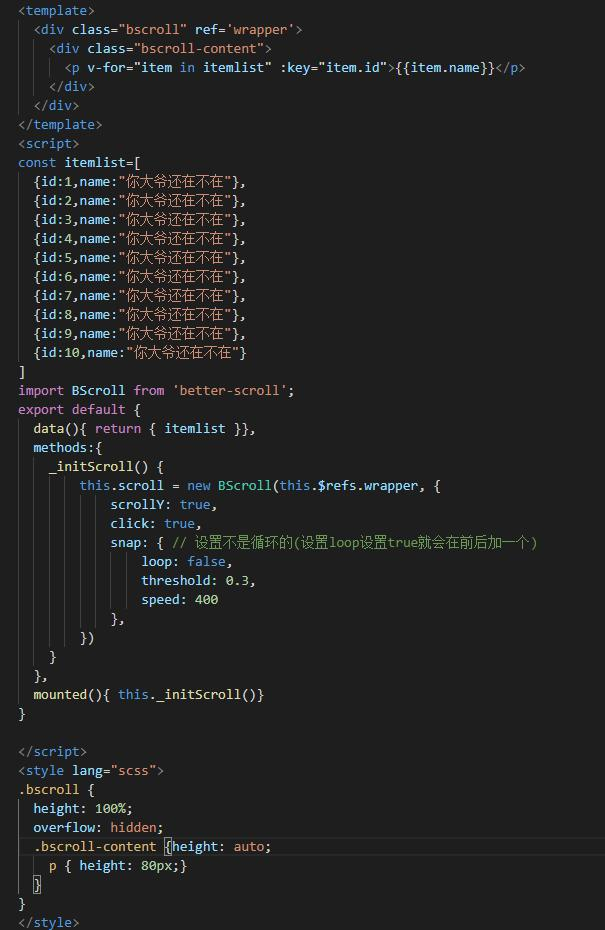

# 官网链接集成
https://www.cnblogs.com/yongdaimi/p/7600052.html
----
### http://www.ruanyifeng.com/blog/2015/08/git-use-process.html
----
### 听阮一峰说git命令

1. https://developer.mozilla.org/zh-CN/docs/Web/JavaScript/A_re-introduction_to_JavaScript

重新认识javascript.  
  1. 准确来说 JavaScript 中的类型应该包括这些：
  * Number（数字）
  * String（字符串）
  * Boolean（布尔）
  * Symbol（符号）（ES2015 新增）
  * Object（对象）
      * Function（函数）
      * Array（数组）
      * Date（日期）
      * RegExp（正则表达式）
  * null（空）
  * undefined（未定义）
  2. 和其他编程语言（如 C 和 Java）不同，JavaScript 不区分整数值和浮点数值，所有数字在 JavaScript 中均用浮点数值表示
----

1. http://support.dun.163.com/captcha-demo/popup

> 第三方验证码
----

1. https://www.cnblogs.com/mary-123/p/11759940.html

> LowDB——轻量级本地JSON数据库
----
1. https://blog.csdn.net/qq_15987295/article/details/79489036

> vuex的是个辅助函数
----
1.https://www.cnblogs.com/tugenhua0707/p/9794423.html

> 1. Vue CountTo vue自带的计数器。
----
http://panjiachen.github.io/countTo/demo/

> Markdown
----
1. http://xianbai.me/learn-md/index.html

> 日期格式转换
----
1. https://www.runoob.com/jsref/jsref-obj-date.html

> chart antv
----
1. https://antv.alipay.com/zh-cn/f2/3.x/demo/index.html

> js-md5
----
1. https://www.cnblogs.com/gluncle/p/9638900.html

> better-scroll 
----
1. https://ustbhuangyi.github.io/better-scroll/doc/zh-hans/#better-scroll%20%E6%98%AF%E4%BB%80%E4%B9%88

附图 ：

>蚂蚁金服Ant Design of Vue
----
1. https://www.antdv.com/docs/vue/introduce-cn/

> jquery weui
----
1. http://old.jqweui.com/components#icons

> git 创建分支
----
1. https://www.cnblogs.com/ysgcs/p/9762417.html

> ES6/7/8
----
1. https://www.jianshu.com/p/390a65d7a353

> axios中文网
----
1. https://www.kancloud.cn/yunye/axios/234845

> mock模拟数据
----
1. https://github.com/nuysoft/Mock/wiki/Getting-Started

> 开源api接口
----
1. https://blog.csdn.net/wang666zoo/article/details/83794926

> 浏览器输入url后发生了什么
----
1. https://yangxiansheng1992.github.io/views/other/%E6%B5%8F%E8%A7%88%E5%99%A8%E8%BE%93%E5%85%A5URL%E5%90%8E%E5%8F%91%E7%94%9F%E4%BA%86%E4%BB%80%E4%B9%88.html#%E4%BA%8C%E3%80%81%E5%BB%BA%E7%AB%8Btcp%E9%93%BE%E6%8E%A5

> vue按需加载组件-webpack require.ensure 
----
https://blog.csdn.net/qq_27626333/article/details/76228578

> 代码分割 - 使用 require.ensure
----
https://www.css88.com/doc/webpack2/guides/code-splitting-require/

> Tree shaking：
----
https://www.css88.com/doc/webpack2/guides/tree-shaking/

> 路由懒加载：
----
https://router.vuejs.org/zh/guide/advanced/lazy-loading.html

> 利用函数式编程封装节流和防抖函数：
----
https://www.jianshu.com/p/c8dcc0afbd1b

> 【HTTP】HTTPS 原理详解：
----
https://baijiahao.baidu.com/s?id=1570143475599137&wfr=spider&for=pc

> css的预处理器详解
----
1. https://blog.csdn.net/qq_14951023/article/details/79502580

> 数组方法大全
2. https://www.cnblogs.com/jiuxia/p/11509616.html

常看博客
----
##### 王大师
[王大师博客](https://www.cnblogs.com/wangdashi/)

##### 一城柳絮吹成雪 
[一城柳絮吹成雪博客](https://www.cnblogs.com/mary-123/p/11759940.html)

##### vue -elementui-admin 
[项目实列](https://panjiachen.github.io/vue-element-admin/#/login?redirect=%2Fdashboard)

deno 未来代替 node.js 是真是假还待时间见证。
[中文链接]('https://nugine.github.io/deno-manual-cn/manual-cn.html')
[英文链接]('https://deno.land/std/manual.md')