# vuex详解
 在SPA单页面组件的开发中 Vue的vuex和React的Redux 都统称为同一状态管理，个人的理解是全局状态管理更合适；简单的理解就是你在state中定义了一个数据之后，你可以在所在项目中的任何一个组件里进行获取、进行修改，并且你的修改可以得到全局的响应变更。下面咱们一步一步地剖析下vuex的使用:
 

**首先要安装**
1. 在 vue 2.0+ 你的vue-cli项目中安装 vuex :

> npm install vuex --save

2. 在src文件目录下新建一个名为store的文件夹，为方便引入并在store文件夹里新建一个index.js,里面的内容如下:
```js
import Vue from 'vue'; 
import Vuex from 'vuex'; 
Vue.use(Vuex);
const store = new Vuex.Store({

}); 
export default store;  
```
3. 在 main.js里面引入store，然后再全局注入一下，这样一来就可以在任何一个组件里面使用this.$store了：
```js
import store from './store'//引入store
 new Vue({
  el: '#app',
  router,
  store, // 使用store
  template: '<App/>',
  components: { App }
})
```
4. 在store文件的index.js中，我们先声明一个state变量，并赋值一个空对象给它，里面随便定义两个初始属性值；然后再在实例化的Vuex.Store里面传入一个空对象，并把刚声明的变量state仍里面：
```js
import Vue from 'vue';   
import Vuex from 'vuex';  
Vue.use(Vuex);  
const state={//要设置的全局访问的state对象
     showFooter: true,  
     changableNum:0  
   };
 const store = new Vuex.Store({  
       state  
    });
export default store;
```
5.  实际上做完上面的四个步骤后，你已经可以用this.$store.state.showFooter或this.$store.state.changebleNum在任何一个组件里面获取showfooter和changebleNum定义的值了，但这不是理想的获取方式.

**vuex官方API提供了一个getters，和vue计算属性computed一样，来实时监听state值的变化(最新状态)，并把它也仍进Vuex.Store里面，具体看下面代码:**
```js
import Vue from 'vue';   
import Vuex from 'vuex';  
Vue.use(Vuex);  
const state={   //要设置的全局访问的state对象
    showFooter: true,   
    changableNum:0
     //要设置的初始属性值   
   };  
const getters = {   //实时监听state值的变化(最新状态)   
    isShow(state) {  //方法名随意,主要是 来承载变化的showFooter的值
       return state.showFooter   
    },   
    getChangedNum(){  //方法名随意,主要是用来承载变化的changableNum的值   
       return state.changebleNum    
    } 
}; 
const store = new Vuex.Store({   
      state, 
      getters  
});    
export default store;  
```

**光有定义的state的初始值，不改变它不是我们想要的需求，接下来要说的就是mutations了.**
1. mutattions也是一个对象，这个对象里面可以放改变state的初始值的方法，具体的用法就是给里面的方法传入参数state或额外的参数,然后利用vue的双向数据驱动进行值的改变，同样的定义好之后也把这个mutations扔进Vuex.Store里面，如下：
```js
import Vue from 'vue';   
import Vuex from 'vuex';   
Vue.use(Vuex);    
 const state={   //要设置的全局访问的state对象    
     showFooter: true,  
     changableNum:0 
     //要设置的初始属性值  
   }; 
const getters = {   //实时监听state值的变化(最新状态)  
    isShow(state) {  //承载变化的showFooter的值
      return state.showFooter  
    }, 
    getChangedNum(){  //承载变化的changebleNum的值  
       return state.changableNum 
    }  
};  
const mutations = {  
    show(state) {   //自定义改变state初始值的方法，这里面的参数除了state之外还可以再传额外的  参数(变量或对象);`  
        state.showFooter = true;  
    },  
    hide(state) {  //同上  
        state.showFooter = false;  
    },
    newNum(state,sum){ //同上，这里面的参数除了state之外还传了需要增加的值sum  
       state.changableNum+=sum;  
    } 
};  
 const store = new Vuex.Store({  
       state,
       getters, 
      mutations 
}); 
export default store;   
```
___

2. 这时候你完全可以用 this.$store.commit('show') 或 this.$store.commit('hide') 以及 this.$store.commit('newNum',6) 在别的组件里面进行改变showfooter和changebleNum的值了，但这不是理想的改变值的方式；因为在 Vuex 中，mutations里面的方法 都是同步事务，意思就是说：比如这里的一个this.$store.commit('newNum',sum)方法,两个组件里用执行得到的值，每次都是一样的，这样肯定不是理想的需求

**此时，vuex官方API提供了一个actions方法**，
1. 其最大的作用可以包含任意异步操作，actions方法是用来异步触发mutations里面的方法，里面自定义的函数接收一个context参数和要变化的形参，context与store实例具有相同的方法和属性，所以它可以执行context.commit(' '),然后也不要忘了把它也扔进Vuex.Store里面：
```js
import Vue from 'vue'; 
import Vuex from 'vuex' 
Vue.use(Vuex);  
 const state={   //要设置的全局访问的state对象`  
     showFooter: true, 
    changableNum:0 
    //要设置的初始属性值 
   };   
const getters = {   //实时监听state值的变化(最新状态) 
    isShow(state) {  //承载变化的showFooter的值  
       return state.showFooter  
  },  
    getChangedNum(){  //承载变化的changebleNum的值  
       return state.changableNum  
    } }; 
const mutations = {
    show(state) {   //自定义改变state初始值的方法，这里面的参数除了state之外还可以再传额外的参数(变量或对象);  
       state.showFooter = true;
   },  
    hide(state) {  //同上  
        state.showFooter = false;  
    },  
    newNum(state,sum){ //同上，这里面的参数除了state之外还传了需要增加的值sum  
       state.changableNum+=sum;  
    }
}; 
 const actions = {  
    hideFooter(context) {  //自定义触发mutations里函数的方法，context与store 实例具有相同方法和属性 
        context.commit('hide');  
    },  
    showFooter(context) {  //同上注释  
        context.commit('show');  
    }, 
    getNewNum(context,num){   //同上注释，num为要变化的形参
      context.commit('newNum',num)  
     } 
};  
  const store = new Vuex.Store({ 
       state,  
       getters, 
       mutations, 
       actions`  
});   
export default store; 
```
2. 如果想在外部组件里进行全局执行actions里面方法的时候，你只需要用执行  
this.$store.dispatch('hideFooter')

或this.$store.dispatch('showFooter')

以及this.$store.dispatch('getNewNum'，6) //6要变化的实参

这样就可以全局改变改变showfooter或changebleNum的值了，如下面的组件中,需求是跳转组件页面后，根据当前所在的路由页面进行隐藏或显示页面底部的tabs选项卡
```html
<template>
  <div id="app">
    <router-view/>
    <FooterBar v-if="isShow" />
  </div>
</template>

<script>
import FooterBar from '@/components/common/FooterBar'
import config from './config/index'
export default {
  name: 'App',
  components:{
    FooterBar:FooterBar
  },
  data(){
    return {
    }
  },
  computed:{
     isShow(){
       return this.$store.getters.isShow;
     }
  },
  watch:{
      $route(to,from){ //跳转组件页面后，监听路由参数中对应的当前页面以及上一个页面
          console.log(to)
        if(to.name=='book'||to.name=='my'){ // to.name来获取当前所显示的页面，从而控制该显示或隐藏footerBar组件
           this.$store.dispatch('showFooter') // 利用派发全局state.showFooter的值来控制        }else{
           this.$store.dispatch('hideFooter')
        }else{
           this.$store.dispatch('hideFooter')
        }
      }
  }
}
</script>
```

**最后就可以做到一呼百应的全局响应状态改变了！**


---
#. modules 模块化 以及 组件中引入 mapGetters、mapActions 和 mapStates的使用

1. 因为在大多数的项目中，我们对于全局状态的管理并不仅仅一种情况的需求，有时有多方面的需求，比如写一个商城项目，你所用到的全局state可能是关于购物车这一块儿的也有可能是关于商品价格这一块儿的；像这样的情况我们就要考虑使用vuex中的 modules 模块化了，具体怎么使用modules呢？咱们继续一步一步的走：

2. 首先，在store文件夹下面新建一个modules文件夹，然后在modules文件里面建立需要管理状态的js文件，既然要把不同部分的状态分开管理，那就要把它们给分成独立的状态文件了，如下图：
图片描述

而对应的store文件夹下面的index.js 里面的内容就直接改写成：
```js
import Vue from 'vue';
import Vuex from 'vuex';
import footerStatus from './modules/footerStatus'
import collection from './modules/collection'
Vue.use(Vuex);

export default new Vuex.Store({
    modules:{
         footerStatus,
         collection
    }
});
```
相应的js，其中的 namespaced:true 表示当你需要在别的文件里面使用( mapGetters、mapActions 接下来会说 )时，里面的方法需要注明来自哪一个模块的方法:
```js
//collection.js

const state={
    collects:[],  //初始化一个colects数组
};
const getters={
  renderCollects(state){ //承载变化的collects
    return state.collects;
  }
};
const mutations={
     pushCollects(state,items){ //如何变化collects,插入items
        state.collects.push(items)
     }
 };
const actions={
    invokePushItems(context,item){ //触发mutations里面的pushCollects ,传入数据形参item 对应到items
        context.commit('pushCollects',item);
    }
};
export default {
     namespaced:true,//用于在全局引用此文件里的方法时标识这一个的文件名
     state,
     getters,
     mutations,
     actions
}
 
//footerStatus.js
 
const state={   //要设置的全局访问的state对象
     showFooter: true,
     changableNum:0
     //要设置的初始属性值
   };
const getters = {   //实时监听state值的变化(最新状态)
    isShow(state) {  //承载变化的showFooter的值
       return state.showFooter
    },
    getChangedNum(){  //承载变化的changebleNum的值
       return state.changableNum
    }
};
const mutations = {
    show(state) {   //自定义改变state初始值的方法，这里面的参数除了state之外还可以再传额外的参数(变量或对象);
        state.showFooter = true;
    },
    hide(state) {  //同上
        state.showFooter = false;
    },
    newNum(state,sum){ //同上，这里面的参数除了state之外还传了需要增加的值sum
       state.changableNum+=sum;
    }
};
 const actions = {
    hideFooter(context) {  //自定义触发mutations里函数的方法，context与store 实例具有相同方法和属性
        context.commit('hide');
    },
    showFooter(context) {  //同上注释
        context.commit('show');
    },
    getNewNum(context,num){   //同上注释，num为要变化的形参
        context.commit('newNum',num)
     }
};
export default {
    namespaced: true, //用于在全局引用此文里的方法时标识这一个的文件名
    state,
    getters,
    mutations,
    actions
}
```
4. 这样一改就有了关于两个模块的state管理文件了 footerStatus.js和collection.js，现在你要运行当前的代码话，项目会报错！因为我们把上面的代码模块化分开了，引用的地方还没有改。接下来咱们一起来看看 mapState,mapGetters,mapActions的使用，首先 在需要用的 组件里面先导入 import {mapState,mapGetters,mapActions} from 'vuex';咱们先修正一下隐藏或显示页面底部的tabs选项卡（就是上面举的临时例子）的组件代码

 ```html
<template>
  <div id="app">
    <router-view/>
    <FooterBar v-if="isShow" />
  </div>
</template>
 
<script>
import {mapState,mapGetters,mapActions} from 'vuex'; //先要引入
import FooterBar from '@/components/common/FooterBar'
import config from './config/index'
export default {
  name: 'App',
  components:{
    FooterBar:FooterBar
  },
  data(){
    return {
    }
  },
  computed:{
    ...mapState({  //这里的...是超引用，ES6的语法，意思是state里有多少属性值我可以在这里放多少属性值
         isShow:state=>state.footerStatus.showFooter //注意这些与上面的区别就是state.footerStatus,
                                                      //里面定义的showFooter是指footerStatus.js里state的showFooter
      }),
     //你也可以用下面的mapGetters来获取isShow的值，貌似下面的更简洁
    /*...mapGetters('footerStatus',{ //footerStatus指的是modules文件夹下的footerStatus.js模块
         isShow:'isShow' //第一个isShow是我自定义的只要对应template里v-if="isShow"就行，
                         //第二个isShow是对应的footerStatus.js里的getters里的isShow
      })*/
  },
  watch:{
      $route(to,from){
        if(to.name=='book'||to.name=='my'){
           this.$store.dispatch('footerStatus/showFooter') //这里改为'footerStatus/showFooter',
                                                           //意思是指footerStatus.js里actions里的showFooter方法
        }else{
           this.$store.dispatch('footerStatus/hideFooter') //同上注释
        }
      }
  }
}
</script>
```
5. 现在项目代码应该就不会报错了，好,最后咱们再来看一下mapActions的用法，实际上上面的this.$store.dispatch('footerStatus/showFooter')已经算是一种执行相应模块的action里的方法了，但有时会牵扯的事件的触发及传值，那就会有下面的mapActions用法了,还记得上面的另一个模块collection.js吗？来看一下里面的actions中的方法结构：
```js
const state={
    collects:[],  //初始化一个colects数组
};
const getters={
  renderCollects(state){ //承载变化的collects
    return state.collects;
  }
};
const mutations={
     pushCollects(state,items){ //如何变化collects,插入items
        state.collects.push(items)
     }
 };
const actions={
    invokePushItems(context,item){ //触发mutations里面的pushCollects ,传入数据形参item 对应到items
        context.commit('pushCollects',item);
    }
};
```
需要传值来实时变动state.collects里的数据，那肯定要在执行它的地方进行传值了，所以下面用到它的地方我们用了个@click来执行这个invokePushItems方法了，并且传入相应的对象数据item,如下：
```html
<template>
  <div >
      <section class="joinState">
           <div class="joinStateHead">
                <span class="h3">全国改性料通讯录</span>
                <span class="joinStatus" @click="invokePushItems(item)">加入收藏列</span>
           </div>
      </section>
  </div>
</template>

<script>
import { mapActions } from 'vuex'
export default {
  components:{
     conditionFilter
  },
  name: 'bookDetail',
  data () {
    return {
      msg: '',
      item:{
         id:'01',
         productName: '苹果',
         price:'1.6元/斤'
       }
    }
  },
  mounted() {
    this.$store.dispatch('footerStatus/hideFooter')
  },
  methods:{
      ...mapActions('collection',[ //collection是指modules文件夹下的collection.js
          'invokePushItems'  //collection.js文件中的actions里的方法，在上面的@click中执行并传入实参
      ])
  }

}
</script>
```
6. 这样一来，在这个组件里面操作的 collecttion.js 中的state的数据，在其他的任何的一个组件里面都会得到相应的更新变化了，获取状态的页面代码如下：
```html
<template>
  </div>
    <div>
        <ul>
            <li v-for="(val,index) in arrList" :key="index">
                <h5>{{val.productName}}</h5>
                 <p>{{val.price}}</p>
            </li>
        </ul>
    </div>
</template>

<script>
import {mapState,mapGetters,mapActions} from 'vuex';
    export default {
        name: 'book',
        data() {
            return {
            }
        },
    computed:{
        // ...mapState({  //用mapState来获取collection.js里面的state的属性值
        //    arrList:state=>state.collection.collects
        // }),
        ...mapGetters('collection',{ //用mapGetters来获取collection.js里面的getters
            arrList:'renderCollects'
        })

    }
    }
</script>
```


## 为了更清晰附上图解-----------vuex

###### vue-cli3.0详解  vuex[点击跳转链接](https://blog.csdn.net/asdf8968/article/details/82703447)
  
#1. State
>vuex中的数据源，我们需要保存的数据就保存在这里，可以在页面通过this.$store.state来获取我们定义的数据;

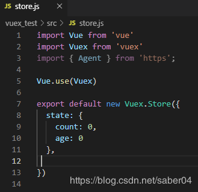  
在home.vue组件中通过this.$store.state.xxx获取

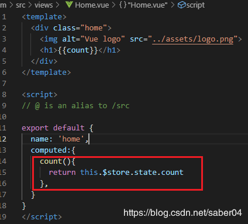  

#2. getter
> * Getter相当于vue中的computed计算属性，getter 的返回值会根据它的依赖被缓存起来，且只有当它的依赖值发生了改变才会被重新计算
 >* 通过属性访问Getter 会暴露为 store.getters 对象，你可以以属性的形式访问这些值：
`this.$store.getters.xxx`
 >* Getters 可以用于监听、state中的值的变化，返回计算后的结果，这里我们修改store.js和home.vue文件如下

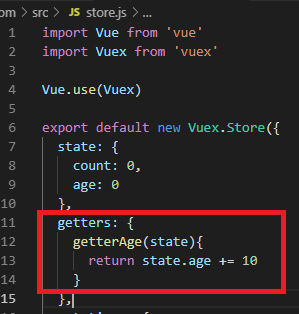    
***
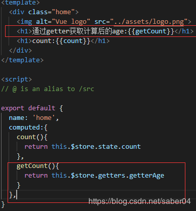     
___
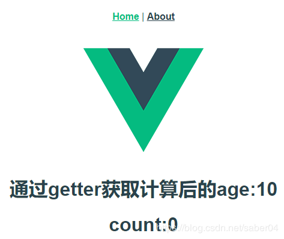    

#3. mutations  
**更改 Vuex 的 store 中的状态的唯一方法是提交 mutation，并且Mutation 必须是同步函数**

* 现在我们已经使用了vuex中的state，接下来我们如何操作这个值呢？ 没错！用mutations和actions，我们继续操作store.js文件
* 我们在sotre.js中定义mutations对象，该对象中有两个方法，mutations里面的参数，第一个默认为state，接下来的为自定义参数。

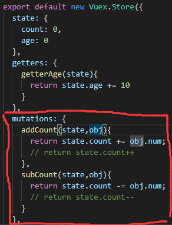 

* 其中第二个参数obj在官方文档就是载荷（payload），可以传入参数及对象。

* 在大多数情况下，载荷应该是一个对象，这样可以包含多个字段并且记录的 mutation 会更易读

* 接下来在home.vue中进行提交mutation，这里的num 就可以看做之前的obj载荷的值。

* 注：关于对象风格的提交方式，请查看[官方文档](https://vuex.vuejs.org/zh/guide/mutations.html)

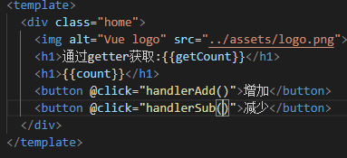   
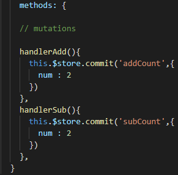   
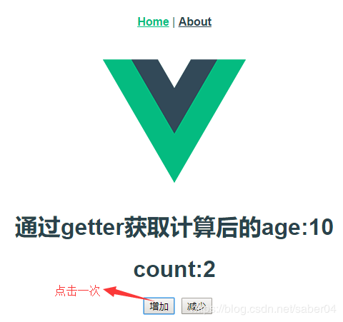   
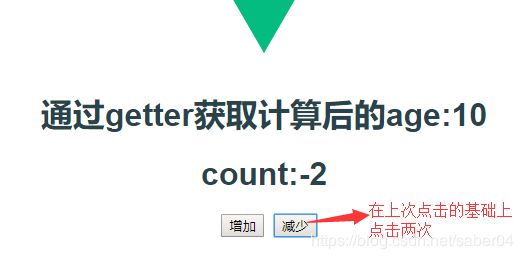   

#4 actios

 上面我们看到啦，通过提交mutation可以同步的更改 Vuex store 中的状态，但是在 mutation 中混合异步调用会导致你的程序很难调试，所以为了处理异步操作，我们继续看Action：

* Action 提交的是 mutation，而不是直接变更状态。
* Action 可以包含任意异步操作。

 Action 函数接受一个与 store 实例具有相同方法和属性的 context 对象，因此你可以调用 context.commit 提交一个 mutation，或者通过 context.state 和 context.getters 来获取 state 和 getters。

 接下来我们先在store.js中定义action来异步提交mutation

 这里可以通过ES2015 的 参数解构 来简化代码,具体查看[官方文档](https://vuex.vuejs.org/zh/guide/actions.html)，特别简单，可以让我们少敲几行代码。

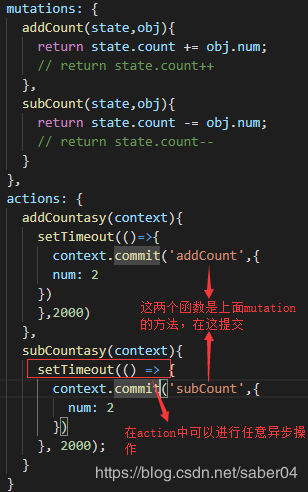  

然后我们在home.vue中分发Action：

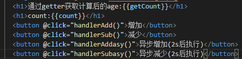  

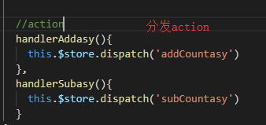  
这里看起来好像比直接提交mutation麻烦，但是它却解决了异步的操作问题，而且熟练啦，其实也很简单  

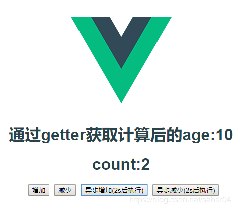  


###### vue-cli3.0的vux到导入方式 如下图:
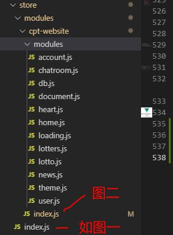  

图一:
```js
import Vue from 'vue'
import Vuex from 'vuex'
import cptwebsite from './modules/cpt-website'

Vue.use(Vuex)

export default new Vuex.Store({
  modules: {
    cptwebsite        // 命名空间名
  }
})
```
图二 
```js
// 其中第一个参数表示相对的文件目录---  './modules' ，第二个参数表示是否包括子目录中的文件    'false代表不包含'，第三个参数表示引入的文件匹配的正则表达式

const files = require.context('./modules', false, /\.js$/)

const modules = {}

files.keys().forEach(key => {
  modules[key.replace(/(\.\/|\.js)/g, '')] = files(key).default
})

export default {
  namespaced: true,   // 开启命名空间
  modules 
}
```

使用
'...mapGetters('cptwebsite/account', ['hasTheme']),'

###### 其中涉及到命名空间

```js
/**
 * account.js
*****************************************************************************************
*/
export default {
 state: {
    bettingPos: {}
  },
 getters: {
    hasTheme: () => process.env.MENUS.theme
  },

 actions: {
    login({ dispatch }, { phone = "", password = "", loginType = 4, loginIp = "" } = {}) {
      return new Promise((resolve, reject) => {
        AccountLogin({
          phone,
          password,
          loginType,
          loginIp
        }).then(async res => {
            const [data, err] = res;
            if (!err) {
              util.cookies.set("uuid", data.uid);
              util.cookies.set("token", data.token);
              await dispatch("cptwebsite/user/set", data, { root: true });
            }
            resolve(res);
          })
          .catch(err => {
            reject(err);
          });
      });
    },
 },
mutations: {
    changeInfo(state, payload) {
      state.info = {
        ...state.info,
        ...payload
      };
    }
  }
}
 
```
```js
组件中使用：
import { mapActions, mapGetters } from 'vuex'

computed: {
    ...mapGetters('cptwebsite/account', ['hasTheme']),
  },
methods：{
 ...mapActions('cptwebsite/account', ['login']),
}
```