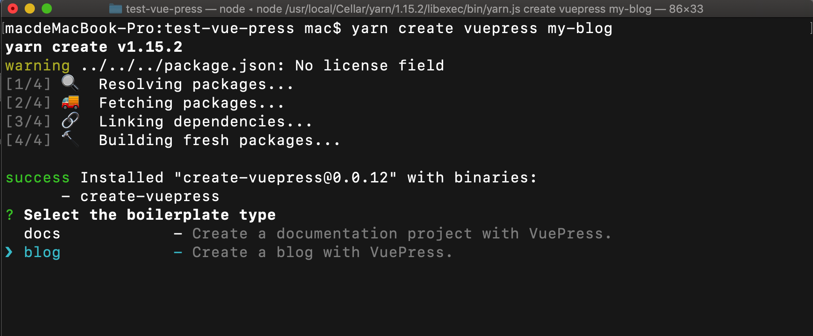
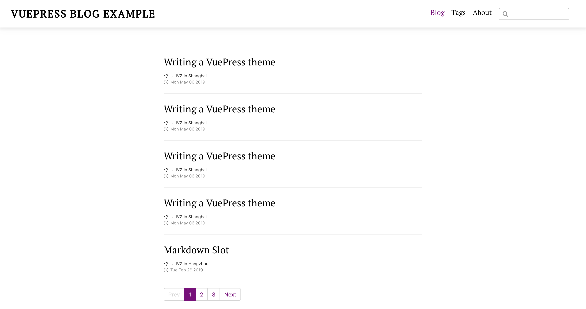

用vuepress搭建个人博客
 ====
1. 结合GitHub Pages 搭建的博客，还没有GitHub Pages，参考[Create a GitHub Pages Repository](https://pages.github.com/)创建你的专属博客仓库。
## 脚手架安装
```sh
yarn create vuepress [appName]
```
要选择blog,不然搭建出来的只是一个package.json文件。然后按照提示一路回车。如下图:


## 安装依赖并且启动
切到项目里面
```sh
yarn && yarn dev
```
默认博客主题样子如下图:

到这里,你的博客就已经搭建成功了。

## 项目结构
```
.
├── README.md
├── blog
│   └── _posts
│   └──.vuepress
│       ├── components
│       │   ├── Foo
│       │   ├── OtherComponent.vue
│       │   └── demo-component.vue
│       ├── config.js
│       ├── enhanceApp.js
│       └── styles
│           ├── global.styl
│           ├── index.styl
│           └── palette.styl
├── package.json
└── yarn.lock
```
` _post 文件夹用来存放博客的目录`。  

`.vuepress`文件夹

* `components `编写自定义主题，请忽略
* `styles`可以更改当前主题的样式,请看官网 :[VuePress-palette-styl](https://v1.vuepress.vuejs.org/zh/config/#palette-styl)
* `config`配置你的博客,参考官网 : [VuePress-config](https://v1.vuepress.vuejs.org/zh/config/)
 
 ## 添加博客

 现在你可以在_post目录下，添加一个你自己的博客了，博客使用markdown语法，如果对markdown不了解可以[markdown-入门](http://xianbai.me/learn-md/index.html)参考

#### 命名格式
博客名必须遵循yyyy-mm-dd-blogname.md的格式。

## 头部链接
```
---
date: 2019-8-8 // 和文件名的日期一致
tag:
  - 编程
author: 一修
location: Manila
---
```
## 添加分类
比如我要在头部添加一个前端基础的分类，打开config.js文件在themeConfig中添加一下代码，详细配置选项可以参考[@vuepress/plugin-blog](https://vuepress-plugin-blog.ulivz.com/guide/getting-started.html#directory-classifier)

```js
modifyBlogPluginOptions(blogPluginOptions) {
    const photographyDirectoryClassifier = {
      id: 'photography',
      dirname: '_photography',
      path: '/photography/',
      itemPermalink: '/photography/:year/:month/:day/:slug',
      pagination: {
        lengthPerPage: 5,
      },
    }

    blogPluginOptions.directories.push(photographyDirectoryClassifier)
    return blogPluginOptions
  },
  ```
然后在nav中添加导航

```js
nav: [
    {
      text: '前端基础',
      link: '/photography/',
    },
  ],
  ```
## 打包部署
在项目根目录新建一个deploy.sh文件，添加以下内容

```js
#!/usr/bin/env sh

# 确保脚本抛出遇到的错误
set -e

# 生成静态文件
npm run docs:build

# 进入生成的文件夹
cd docs/.vuepress/dist

# 如果是发布到自定义域名
# echo 'www.example.com' > CNAME

git init
git add -A
git commit -m 'deploy'

# 如果发布到 https://<USERNAME>.github.io
# git push -f git@github.com:<USERNAME>/<USERNAME>.github.io.git master

# 如果发布到 https://<USERNAME>.github.io/<REPO>
# git push -f git@github.com:<USERNAME>/<REPO>.git master:gh-pages

cd -
```

在package.json添加脚本命令
```json
"scripts": {
  "deploy": "bash deploy.sh"
}
```
杀杀杀


